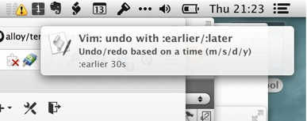

# Reminders

I normally pick up little snippets of information that I either save in Evernote
and never see again or don't write down and promptly forget about.

Reminders sets up a regular task to display an OS X User Notification containing
one of the little pearls of wisdom I've added to it. 



# Installation
1.  Update the paths in the plist file in support
2.  Set the desired time between alerts
3.  Link or move the plist to ~/Library/LaunchAgents/
4.  Load the agent into launchd 

```
launchctl load ~/Library/LaunchAgents/uk.co.leftbrained.reminders.plist
```


## Todo

* Fix escaping so I can use punctation in my tips
* Add weighting to tips
* Templatize the plist file to insert paths dynamically
* CLI option to change the time between tips
* CLI option to change the focus of tips (e.g. only show "Spanish")
* Cocoa stub application based on [Terminal
* Notifier](https://github.com/alloy/terminal-notifier) to give a custom icon
 and grouping

## License

MIT © [Gavin Montague](http://leftbrained.co.uk)
